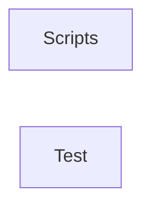

# Proposed Architecture

## Application Architecture

```mermaid
graph TD;
	Commands["Slash Commands"] --> Services;
	Events --> Services;
	Services <--> DB[("Storage (SQLite)")];
	Scripts;
	Test;
```

## Development & Administration

```mermaid
graph TD;
	Scripts ~~~ Test;
```
